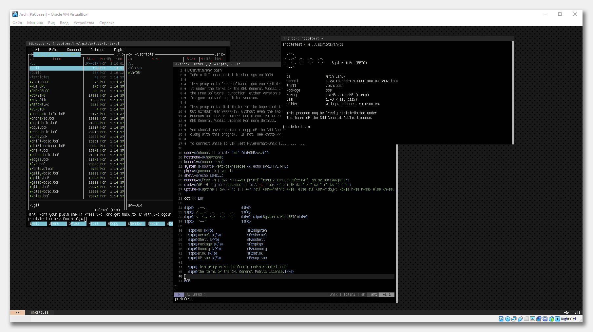

#### Installing i3-grap

Install from the official repository, i3-grap directly window manager.

Then we clone the theme files.

git clone https://github.com/appath/dotfiles.git

PKG pacman -S
```bash
- xorg 
- xorg-xinit 
- i3-gaps 
- i3blocks 
- rxvt-unicode 
- tree 
- git 
- tmux 
- vim 
- mc 
- fontconfig
```
Games
```bash
Tetris:
git clone https://github.com/vicgeralds/vitetris.git
Snake
git clone https://github.com/alexdantas/nSnake.git
Building:
make
make install
./tetris or ./nsnake
```

install font

git clone https://github.com/whitelynx/artwiz-fonts-wl.git

```bash
# cd ./MAKEFILES/artwiz-fonts-wl
```

Building Fonts
```bash
# make
```
Installing Fonts
```bash
# make install
```
On Arch Linux, this file is named /etc/fonts/conf.d/70-no-bitmaps.conf, and the file /etc/fonts/conf.avail/70-yes-bitmaps.conf should be linked in its place:
```bash
# rm /etc/fonts/conf.d/70-no-bitmaps.conf
# ln -s /etc/fonts/conf.avail/70-yes-bitmaps.conf /etc/fonts/conf.d/
```

#### KeyMod
```bash
Mod1+Shift+r Restart WM (i3-grap)
Mod1+Shift+q Exit WM (i3-grap)

Mod+1 > Workspace 1
(Four desktops 1,2,3 or 4)

Mod1+b > PanelBar Bottom
(Hide or Display)

Mod1+Return > Terminal
Mod1+e Kill (Terminal)

Mod1+m > Mc (File Manager)
Mod1+t > Tmux
Mod1+g > nSnake (Game)
```
#### Exhaust

#### /* wm desktops i3-grap theme */
