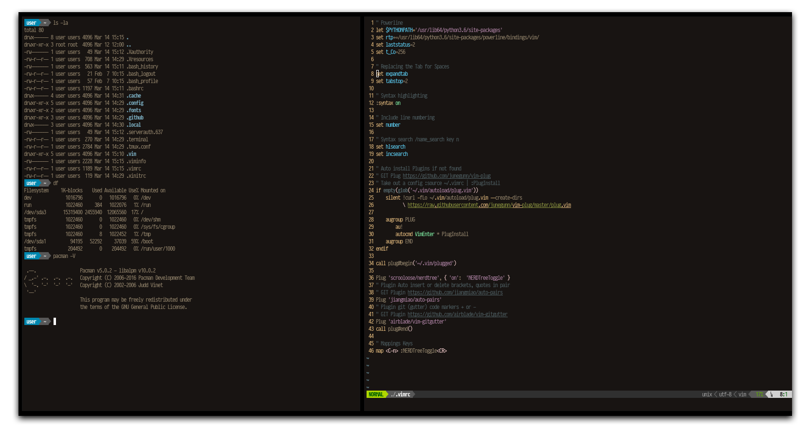

<a href="https://area31.net.br" title="area31.net.br"> ... area31</a>

BSPWM DESKTOP
====
Installing

     pacman -S xorg xorg-xinit puthon3.6 vim python-pip curl git wget sxhkd bspwm tmux htop dfc mupdf
     yaourt -S rxvt-unicode-patched lfm

Easy Powerline BASH, VIM

     $ su
     $ pip install powerline-status
     $ powerline-daemon -q
     $ POWERLINE_BASH_CONTINUATION=1
     $ POWERLINE_BASH_SELECT=1
     $ . /usr/lib64/python3.6/site-packages/powerline/bindings/bash/powerline.sh | Key "TAB "Return
     
 

.[git: powerline/powerline] 'https://github.com/powerline/powerline'

.[video: install] 'https://www.youtube.com/watch?v=WVGDJat3rd8&feature=youtu.be'
