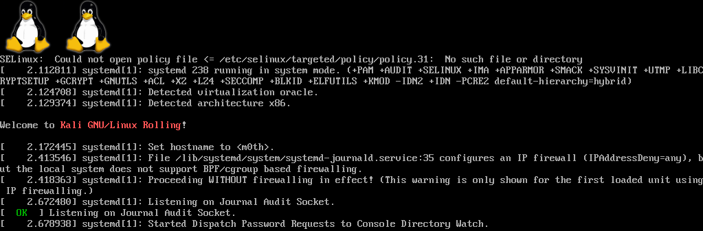
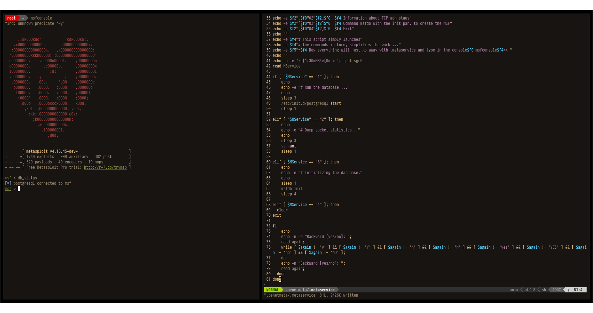
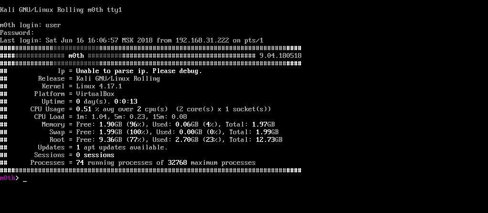

5/5000

Night m0th

Just a theme made for work, well, kind of hacking a bad kid and everything in the same spirit.
That it was a little pleasant to work. And then the dark terminal has become boring

(favorite laptop ThinkPad T410)

GRAY BSPWM DESKTOP
====
Installing

     Kali
     apt install xorg python3.6 python-pip curl git wget sxhkd bspwm tmux vim-nox htop dfc mupdf rxvt-unicode lfm
     nmap openssh-server bison build-essential dkms flex gcc g++ libncurses5-dev make fakeroot fontconfig glances
     

[Kali Linux](https://www.kali.org/) Minimal [+ISO](https://docs.kali.org/installation/kali-linux-network-mini-iso-install)

Accessories Hcipc M503-1

[Kernel Archives](https://www.kernel.org/)

Compiling

Tux [wikipedia](https://ru.wikipedia.org/wiki/Tux)

         vga=0x318

Kali Grub, Font Video Driver VirtualBox
      
      nano -w /etc/default/grub 
      nano -w /etc/grub.d/05_debian_theme
      Set the traditional Debian blue theme
      Custom Kali light gray with dark tones
          light-gray/black
          black/light-gray
          
      update-grub2
      dpkg-reconfigure console-setup
      apt update && apt install -y linux-headers-$(uname -r)
      mount /dev/sr0 /media/cdrom
      cp /media/cdrom/VBoxLinuxAdditions.run ~/
      chmod 755 VBoxLinuxAdditions.run
      ./VBoxLinuxAdditions.run
      reboot

Kali +G_

SSH

     $ service --status-all
     $ update-rc.d -f ssh remove
     $ update-rc.d -f ssh defaults
     $ cd /etc/ssh/
     $ mkdir insecure_original_default_kali_keys
     $ mv ssh_host_* insecure_original_default_kali_keys/
     $ dpkg-reconfigure openssh-server
     $ vim /usr/sbin/update-rc.d
     
ssh disabled => ssh enabled [ok]...

Save file update-rc.d

     $ update-rc.d -f ssh remove && update-rc.d -f ssh defaults
     $ systemctl start ssh
     
MotD [links](https://github.com/OutsideIT/FireMotD)

(Не стал изобретать велосипеды просто взял у товарища под ником -willemdh- такую штуку FireMotD
     
Did not invent the bicycles just picked up from a friend under a nickname -willemdh- such a thing FireMotD)

Установку по FireMotDе читайте у него 

Install on FireMotDe read from him
     
Новый файл скрипта нужен будет

A new script file will be needed

     $ touch /etc/update-motd.d/15-firemotd

По умолчанию отменим старые привязки от файла

By default, we will cancel old file bindings

     $ chmod a-x /etc/update-motd.d/10-uname
     
А новый применим

And the new one is applicable

     $ chmod a+x /etc/update-motd.d/15-firemotd
     
Добавим пару бл.в.ыф

Add a couple bl.v.if

     $ vim /etc/update-motd.d/15-firemotd
               #!/bin/sh
               /usr/local/bin/FireMotD --theme original
               и сохраним файл
               and save the file
     
Easy Powerline BASH, VIM

     $ su
     $ pip install powerline-status
     $ powerline-daemon -q
     $ POWERLINE_BASH_CONTINUATION=1
     $ POWERLINE_BASH_SELECT=1
     $ . /usr/lib64/python3.6/site-packages/powerline/bindings/bash/powerline.sh | Key "TAB "Return
 
Screenshots [*1](scrot/screenshot_1.jpg), [*2](scrot/screenshot_2.jpg)
 

 
[SHH_KEY](https://raw.githubusercontent.com/appath/dotfiles/master/lBox/SHH_KEY)
 
[MetaSploit](https://github.com/rapid7/metasploit-framework)

Запуск Metasploit Framewor >> Launch the Metasploit Framework

     Database
     /etc/init.d/postgresql start
     работает или нет ? postgresql и убедившись, что порт 5432 прослушивается
     works or not? postgresql and making sure that port 5432 is listening
     ss -ant
     netstat -anp | grep 5432
     Инициализируем базу данных Metasploit
     Initializing the Metasploit database
     msfdb init
     Запускаем мсфконсо́ль
     We launch
     msfconsole
     
     Если вы предпочитаете иметь запущенные PostgreSQL
     If you prefer to have running PostgreSQL
     update-rc.d postgresql enable
     
МОНТИРОВАНИЕ ФЛЕШКИ

MOUNTING THE FILE
     
     $  fdisk -l
     Как видите, здесь мы можем посмотреть детальную информацию об устройстве.
     As you can see, here we can see detailed information about the device.
     $ mkdir /mnt/usb
     Монтируем флешку с помощью команды mount
     Mount the USB flash drive using the mount command
     $ mount /dev/sdx1 /mnt/usb
     После завершения работы с флешкой не забудьте ее отмонтировать.
     After you finish working with the flash drive, do not forget to unmount it.
     $ umount /dev/sdx1
     
++ SCRIPT service [+.metaservice](https://raw.githubusercontent.com/appath/dotfiles/master/lBox/.metaservice)

-+TERM

Cobra_2 [+ansi](https://raw.githubusercontent.com/appath/dotfiles/master/lBox/cobra_2.ansi.txt)

.[git: powerline/powerline] 'https://github.com/powerline/powerline'

.[video: install] 'https://www.youtube.com/watch?v=WVGDJat3rd8&feature=youtu.be'
